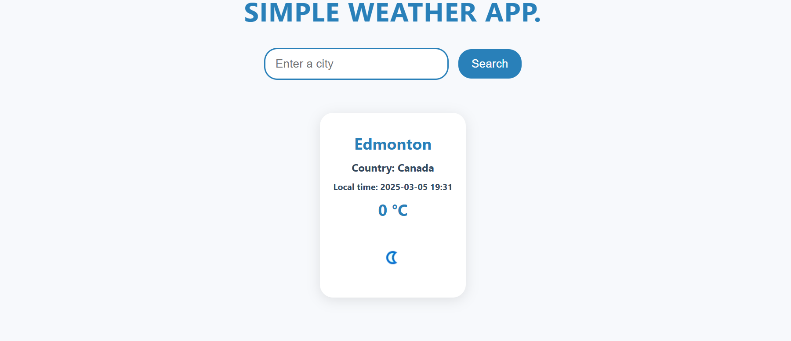
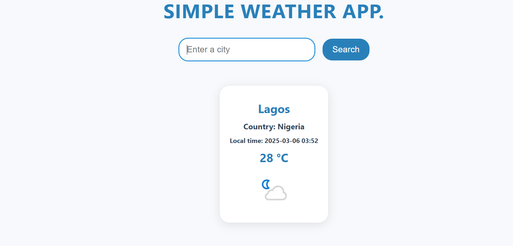
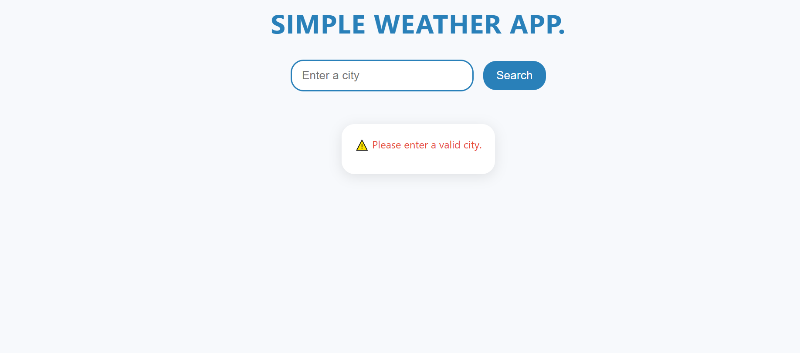

# ☁️ Simple Weather App

A web application that fetches real-time weather data based on user-inputted city names. Built using HTML, CSS, JavaScript, and the WeatherAPI.

## 🚀 Features
- Fetches real-time weather data from [WeatherAPI](https://www.weatherapi.com/)
- Displays city name, country, local time, temperature, weather condition, and an icon
- Handles invalid city names with an error message
- Clean and responsive UI


## 📸 Screenshot


 
 ## Error Handling 
 

 
## 🔧 Technologies Used
- HTML
- CSS
- JavaScript
- [Axios](https://github.com/axios/axios) (for API requests)

## 📂 Installation
1. Clone the repository:
   ```sh
   git clone https://github.com/DevOlabode/weather-App.git
   ```  
2. Open `weatherAppAPI.html` in a browser.

## 🤝 Contributing
Feel free to submit issues or pull requests if you have any suggestions!

## 📝 License
This project is licensed under the MIT License.
